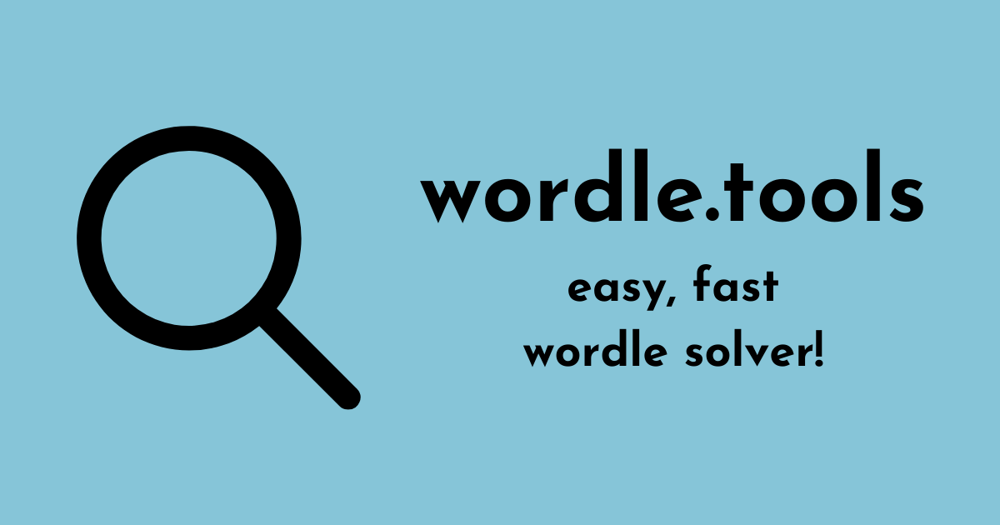

# `wordle.tools`

Efficiently complete Wordle puzzles with this solver! [Try it yourself at wordle.tools](https://wordle.tools)

## Navigating the Repo

wordle.tools is a straightforward project:

* `index.html`: HTML content of the website.
* `scripts.js`: JavaScript logic of the website.
* `styles.css`: CSS stylesheet of the website.
* `words.b64.txt`: All English words, comma-separated, and base64-encoded.
* `py-scripts/get-words.py`: Python script used to generate the words list.

## Fun Facts

* wordle.tools supports IPv6!
* wordle.tools matches your system's light mode/dark mode preferences!
* wordle.tools is responsive!

## Acknowledgements

* Wordle is created by [Josh Wardle](https://www.powerlanguage.co.uk/).
* Word list is from the [`dwyl/english-words` repository](https://github.com/dwyl/english-words) and originally created by Infochimps.
* Website is hosted by GitHub pages.
